# 去中心化彩票系统

<div align=center>
   
   
</div>

## 简介

基于solidity搭建的去中心化彩票交易系统，支持管理员发布竞猜项目和普通用户购买和自由交易彩票凭证（在开奖前），前端使用Vue3(Element plus) + web3.js，可以在Ganache测试链上正常运行。

## 如何运行

1. 在本地启动ganache应用，修改端口为8545，gas limit 视情况调整（如果出现部署超出gas limit的情况需要增大gas limit）
2. 将ganache中的私钥信息添加到`./contracts/hardhat.config.ts`中
3. 在 `./contracts` 中安装需要的依赖，运行如下的命令：
    ```bash
    npm install
    ```
4. 在 `./contracts` 中编译合约，运行如下的命令：
    ```bash
    npx hardhat compile
    ```
5. 在`./contracts`中部署合约，运行如下的命令，这里需要记录输出的合约地址：
    ```bash
    npx hardhat run scripts/deploy.ts --network ganache
    ```
6. 将编译出的abi文件移动到`./frontend/src/utils/abis`目录下，并根据上一步输出的结果修改`./frontend/src/utils/contract-addresses.json`中的合约地址
7. 在 `./frontend` 中安装需要的依赖，运行如下的命令：
    ```bash
    npm install
    ```
8. 在 `./frontend` 中启动前端程序，运行如下的命令：
    ```bash
    npm run dev
    ```
9. 访问`http://localhost:5173/`，进行相应操作

## 功能实现分析

> 这里对本身的需求进行了一些调整：
> 1. 某个竞猜项目的奖池金额来源有两部分，竞猜项目奖池总金额 = 公证人设置的项目奖池基础金额 + 该项目所有彩票的投注金额总和，这样可以避免参与人过多导致最终获胜分到的奖励过少的问题。
> 2. 开奖奖金分配规则修改为了按照某张获胜彩票的金额占所有获胜彩票总金额的比例来分配（原本是平分），这样允许用户自定义金额购买彩票才合理，不然中奖都得一样多的钱为什么要花很多钱买彩票。
> 3. 增加了取消出售自己彩票和公证人退款的功能，主要是为了让系统能应对更多状况。

### 创建竞猜项目

公证人可以创建许多竞猜项目，要求有两个以上选项，需要设置彩票基础奖池金额和结束时间。

这里使用使用一个结构体数组来存储整个项目中的所有竞猜项目，公证人创建竞猜项目后相关信息会被存储到数组中，活动的id也是它在数组中的索引，以便后续根据活动id查询活动信息。

```solidity
struct Activity {
    uint256 id; // 活动ID
    string name; // 活动名称
    string[] options; // 选项列表
    uint32 endTime; // 结束时间
    uint32 baseAmount; // 奖池基础金额
    uint32 totalAmount; // 奖池目前总金额
    ActivityStatus status; // 活动状态
    uint32 winningOptionIndex; // 获胜选项索引
}
Activity[] public activities;
```

### 发行 ERC20 合约

发行了一个自己的ERC20合约，并允许每个用户领取10000ERC20积分（领取空投）。

自己的ERC20合约继承自ERC20即可，然后维护一个用户address到是否领过空投布尔值的`mapping`用于记录哪些用户已经领取过空投了，这部分和demo基本是一样的。

### 购买彩票

用户可以购买自定义金额的彩票，购买后获得对应的彩票凭证（ERC721中的token）

自己的ERC721合约继承ERC721即可，这里维护了ticket id，使它从0开始增加。因为我设计了查询自己拥有的彩票的功能，所以还需要维护一个用户address到ticket id的mapping来记录每个人拥有哪些彩票token。按照我调整后的需求，开奖时是按照购买金额分配中奖奖励的，所以除了彩票对应的活动id和选项外，还需要存储彩票的购买金额是多少，用如下的结构体记录彩票的元信息，在用户购买彩票后，彩票的元信息会加入对应的数组中，同样彩票id也是它在数组中的索引，便于后续查询。

```solidity
struct Ticket {
    uint256 id; // 凭证NFT的ID
    uint256 activityId; // 活动ID
    uint32 amount; // 投注金额
    uint32 optionIndex; // 投注选项索引
    TicketStatus status; // 凭证状态
}
Ticket[] public tickets;
```

### 挂单出售彩票

在开奖前，用户之间可以随意买卖彩票，一个用户可以自定义金额挂单出售自己的彩票凭证。

出售信息需要存储，以便所有用户查询，这里使用如下的结构体数组。在挂单出售期间彩票凭证是从用户转移到了合约上，所以需要记录卖家地址，这样才能在挂单出售被取消时将彩票凭证返还给用户。

```solidity
struct Listing {
    uint256 id; // 出售ID
    uint256 ticketId; // 凭证ID
    // 因为在Listing期间ticket的会从转移给合约
    // 所以必须记录原来的拥有者是谁
    address seller; // 卖家地址
    uint32 price; // 价格
    ListingStatus status; // 状态
}
Listing[] public listings;
```

### 链上订单簿

不同卖方会以不同价格出售同一个活动的彩票，买家可以查询一个活动的全部在售彩票，择优（对比这张彩票的本身的金额和出售价格等）购买。

维护一个活动id到挂单出售id的mapping，在查询某个活动id时，先根据mapping得到对应的挂单出售id数组，然后根据挂单出售id去挂单信息数组中取出对应的详细信息。

### 购买挂单出售的彩票

当用户觉得一个正在出售中的彩票有利可图时，可以选择购买它，先到先得。

首先验证买家和卖家不是同一个人，然后先将和售价相同的代币从买家转移给卖家，转移成功后再将彩票凭证从合约转移给买家，并更新上面提到的用户address到彩票 id的映射。

### 取消挂单出售

如果卖家觉得自己挂单出售但还没卖出的彩票现在又有价值了，可以选择取消挂单出售。

因为需要知道一个用户到底有哪些挂单，所以维护一个用户address到挂单id的mapping，然后在查询某个用户地址时，先根据mapping得到对应的挂单id，再根据挂单id去挂单信息数组中取出对应的详细信息。

### 开奖

公证人可以输入竞猜结果并进行结算，所有胜利者按照中奖彩票的金额分配奖池中的奖金。

开奖首先要清理这个活动对应的挂单，把对应的彩票凭证从合约转移给对应的用户，然后校验有没有人中奖，如果出现无人中奖的极端情况，则会自动退款，如果有人获奖，那么就去按照中奖彩票的金额分配奖池中的奖金（链上没有浮点数，所以获奖金额向下取整）。

### 退款

公证人可以主动选择退款，以应对一些意外情况导致竞猜活动需要被取消。

退款首先也是要清理这个活动对应的挂单，把对应的彩票token从合约转移给对应的用户，然后将这个活动的彩票对应的金额依次退还给用户，所以还需要维护一个活动id到彩票凭证id的mapping，这样才能快速知道一个活动到底有哪些彩票。

## 项目运行截图

项目运行成功的关键页面和流程截图。主要包括操作流程以及和区块链交互的截图。

### 首页

网站的首页，在该页面可以连接钱包和领取空投，初始状态如下：

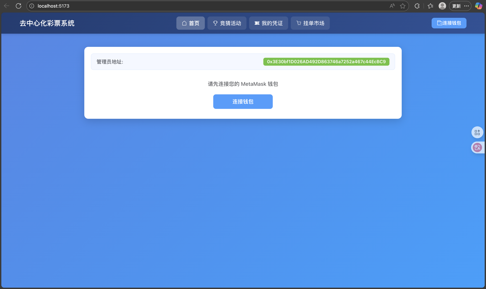

连接钱包可以一次性把需要用到的账户都选了，连接成功后的首页如下，因为这里都是新账户，所以浙大币余额都为0，这个页面还显示了管理员的地址和当前用户地址。

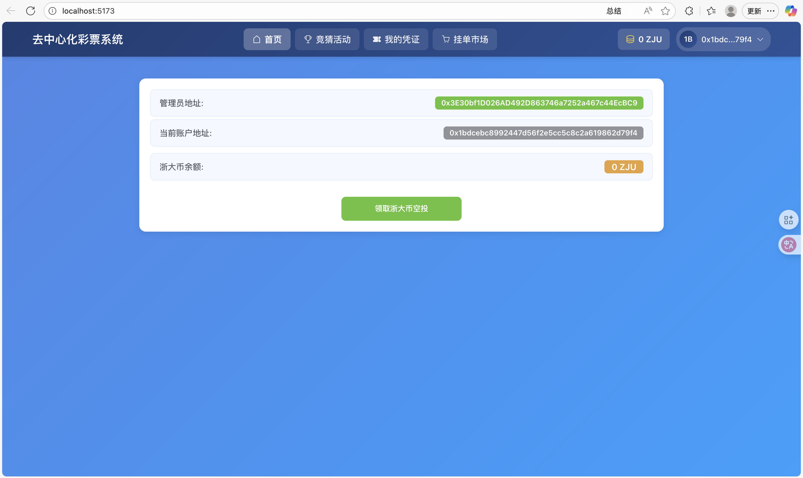

点击领取浙大币空投后余额变为了10000，并且按钮变灰了，不允许反复领取。

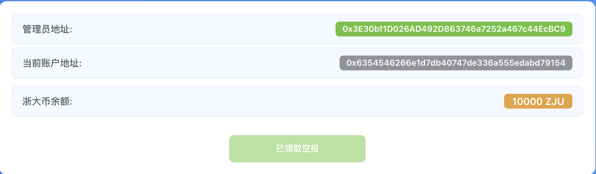

如果当前用户是管理员的话，可以在首页看到创建竞猜项目的输入框

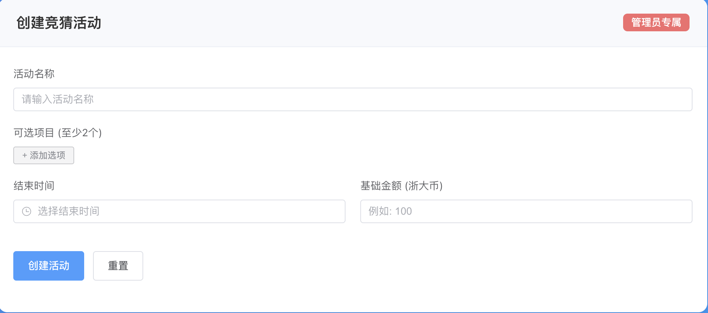

可以在这个输入框中填写创建活动必要的信息，如果信息有确实或者选项不足，点击创建活动按钮会提示你将信息补充完全。下面是一个正常创建项目的示例：

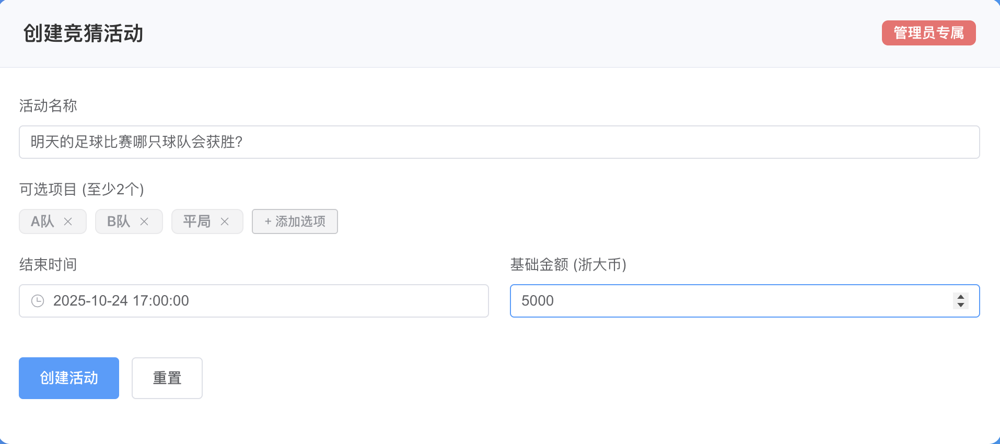

### 竞猜活动页面

在管理员创建了一些活动后，所有用户都可以在竞猜活动页面看到这些活动的信息，下图为管理员的，管理员自己可以参与活动，不过更为重要的是管理员可以开奖和退款

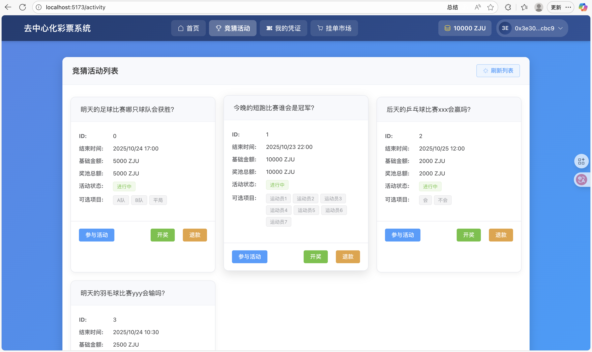

如果是普通用户，那么这个页面就只有参与活动

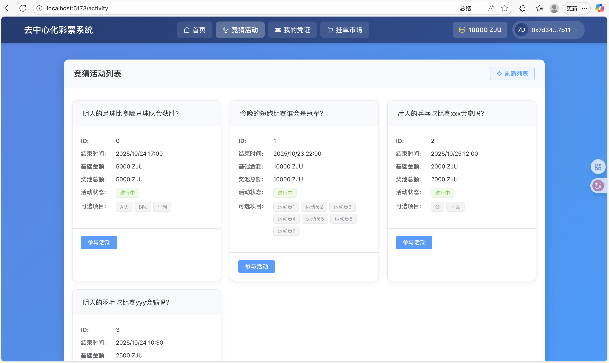

点击参与活动会弹出一个对话框，可以选择投注的项目和填写投注的金额

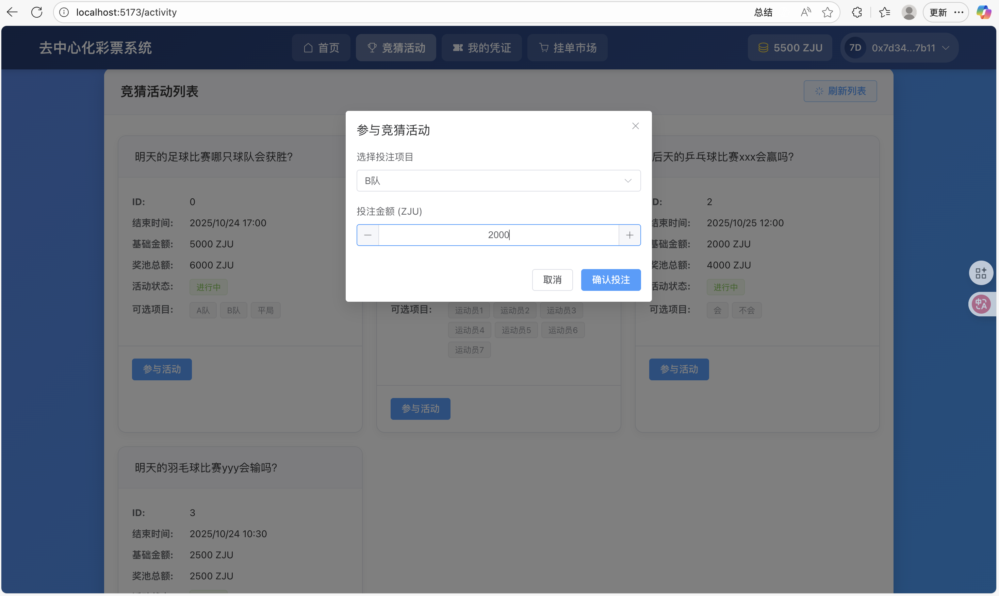

管理员点击退款按钮，会弹出一个对话框提示确认是否退款

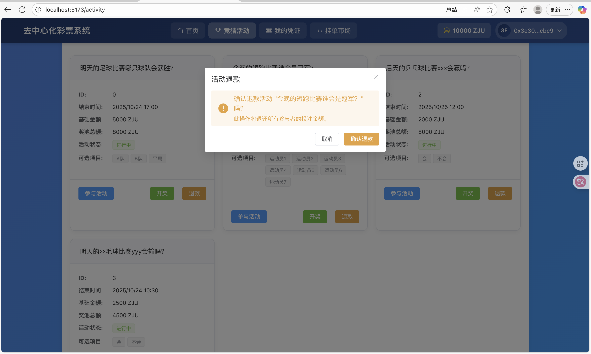

管理员点击开奖按钮，会弹出一个弹窗提示确认是否开奖

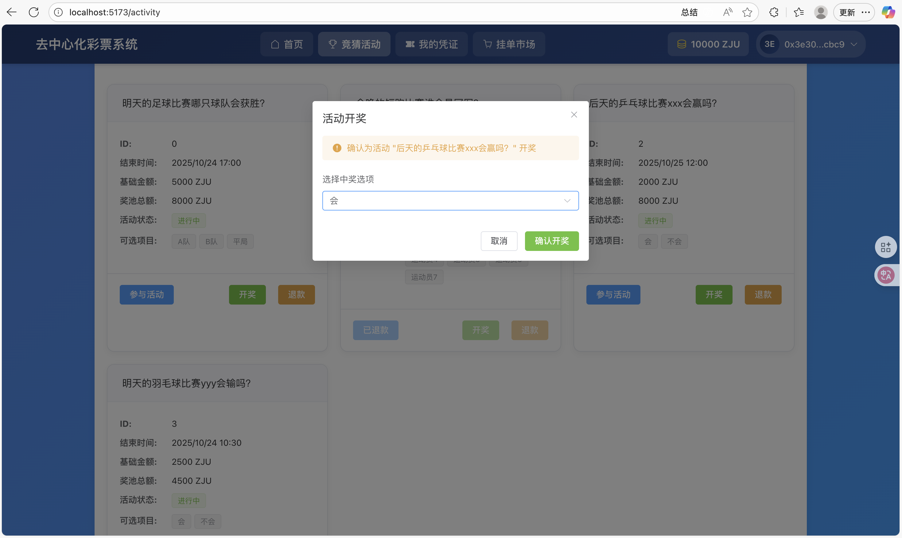

### 我的凭证界面

在购买了一些彩票后，可以在我的凭证界面看到用户自己拥有的凭证

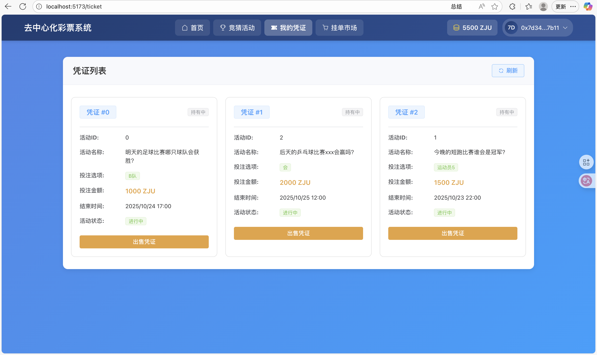

点击出售凭证会弹出一个对话框，可以输入出售价格，如果你觉得你的彩票很有可能中奖，但你想现在套现就可以输入一个比投注金额更高的价格，反之可以输一个更低的价格

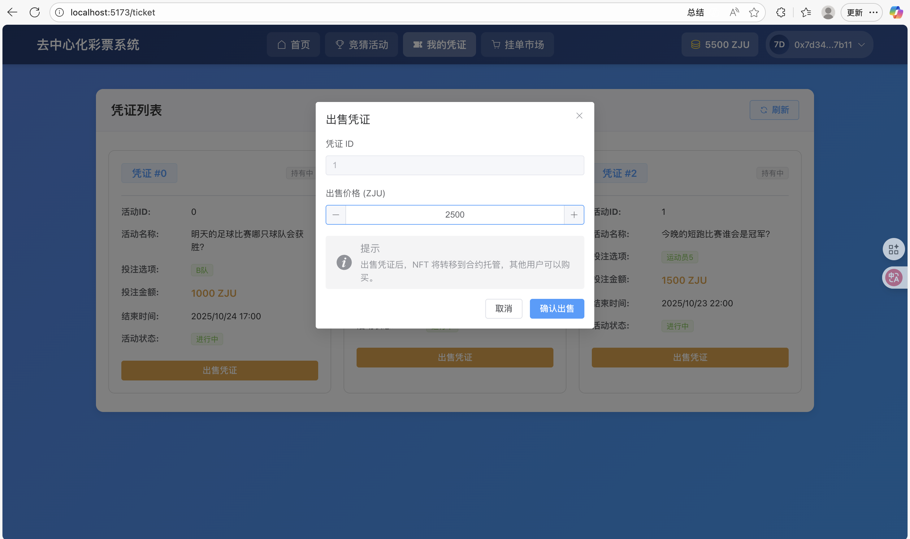

### 挂单市场界面

在一些用户挂单出售了自己的凭证之后，可以在挂单市场界面查看，可以在输入框输入对应的活动id，然后就显示这个活动的全部挂单记录，如果是别人的挂单记录，会显示购买凭证按钮，如果是自己的则会显示取消出售按钮

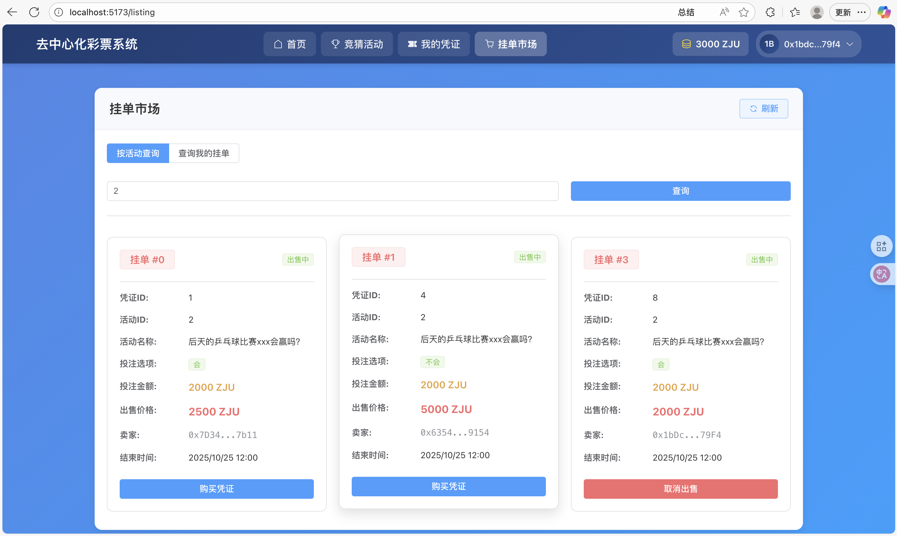

点击购买凭证按钮，会弹出一个对话框让你确认是否购买；点击取消出售会直接弹MetaMask的确认框

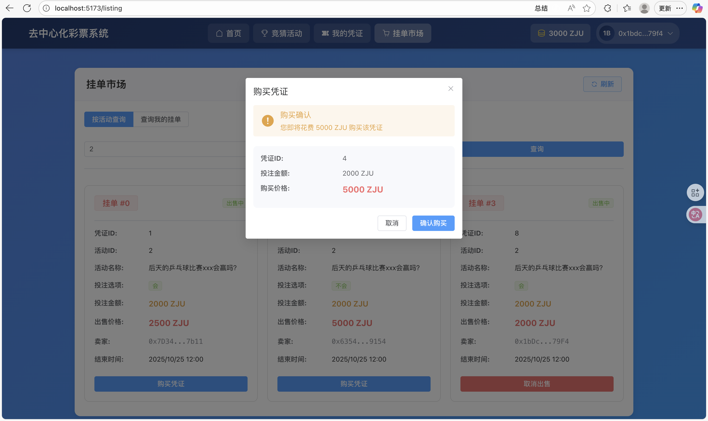

一番操作后某些挂单的状态发生了改变，0号挂单变成了已售出，3号挂单变成了已取消

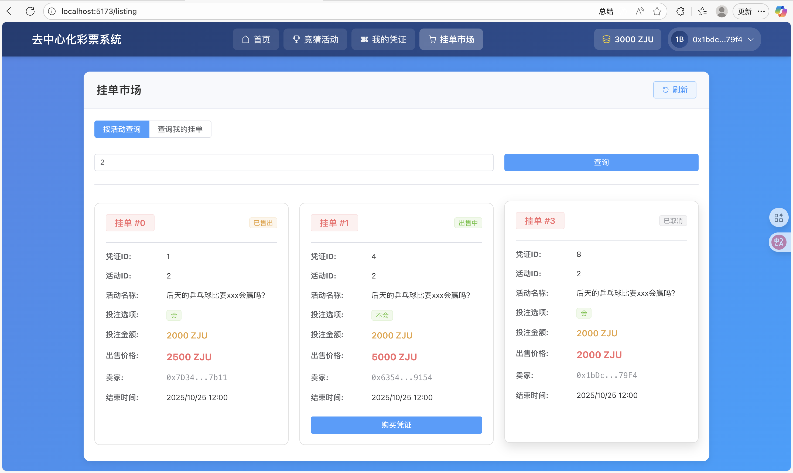

在这个页面还可以查询自己的挂单，方便确认自己的挂单是否出售成功，以及取消自己不再想出售的挂单。

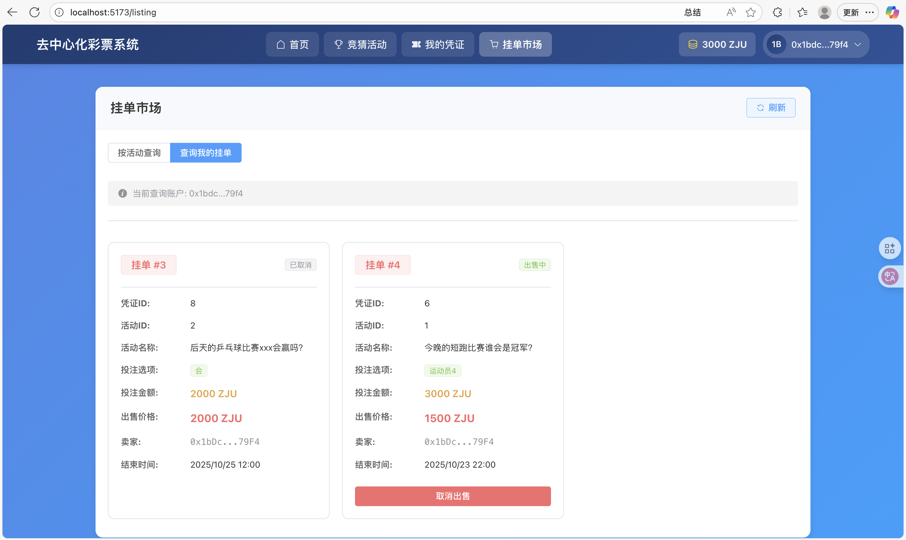

## 参考内容

- 课程的参考Demo见：[DEMOs](https://github.com/LBruyne/blockchain-course-demos)。

- 快速实现 ERC721 和 ERC20：[模版](https://wizard.openzeppelin.com/#erc20)。记得安装相关依赖 ``"@openzeppelin/contracts": "^5.0.0"``。

- 如何实现ETH和ERC20的兑换？ [参考讲解](https://www.wtf.academy/en/docs/solidity-103/DEX/)

如果有其它参考的内容，也请在这里陈列。