# 去中心化彩票系统

<div align=center>
   
   
</div>

## 项目简介

本项目是一个基于 Solidity 智能合约开发的去中心化彩票交易系统。系统支持管理员发布竞猜项目，普通用户购买彩票凭证并在开奖前进行自由交易。前端采用 Vue3 + Element Plus + Web3.js 技术栈开发，可在 Ganache 测试网络上稳定运行。

## 运行指南

1. **启动 Ganache 测试网络**
   - 在本地启动 Ganache 应用
   - 设置端口为 8545
   - 根据实际情况调整 gas limit（如遇部署超出 gas limit 错误，需增大 gas limit 设置）

2. **配置私钥信息**：将 Ganache 中的私钥信息添加到 `./contracts/hardhat.config.ts` 文件中

1. **安装依赖**
   ```bash
   cd ./contracts
   npm install
   ```

2. **编译合约**
   ```bash
   npx hardhat compile
   ```

3. **部署合约**
   ```bash
   npx hardhat run scripts/deploy.ts --network ganache
   ```
   记录输出的合约地址，后续配置需要使用

4. **配置合约信息**
   - 将编译生成的 ABI 文件移动到 `./frontend/src/utils/abis` 目录
   - 根据上一步输出的合约地址，更新 `./frontend/src/utils/contract-addresses.json` 文件

5. **安装前端依赖**
   ```bash
   cd ./frontend
   npm install
   ```

6. **启动前端**
   ```bash
   npm run dev
   ```

7. **访问应用**
   - 打开浏览器访问 `http://localhost:5173/`
   - 开始使用去中心化彩票系统

## 功能实现分析

### 系统设计调整

本项目在原有需求基础上进行了以下优化调整：

1. **奖池机制优化**
   - 奖池总金额 = 公证人设置的基础金额 + 所有彩票投注金额总和
   - 避免参与人数过多导致获胜者奖励过少的问题

2. **奖金分配规则改进**
   - 采用按投注金额比例分配奖金的方式（替代原有的平均分配）
   - 支持用户自定义投注金额，体现"多投多得"的公平原则

3. **功能扩展**
   - 增加用户取消出售彩票功能
   - 增加公证人主动退款功能
   - 提升系统应对各种异常情况的能力

### 创建竞猜项目

公证人可创建多个竞猜项目，每个项目需满足以下条件：
- 提供两个或以上竞猜选项
- 设置基础奖池金额
- 设定活动结束时间

**技术实现**：使用结构体数组存储所有竞猜项目信息，项目 ID 即为数组索引，便于后续查询和管理。公证人每创建一个项目，都会将相应的信息添加到数组中。

```solidity
struct Activity {
    uint256 id; // 活动ID
    string name; // 活动名称
    string[] options; // 选项列表
    uint32 endTime; // 结束时间
    uint32 baseAmount; // 奖池基础金额
    uint32 totalAmount; // 奖池目前总金额
    ActivityStatus status; // 活动状态
    uint32 winningOptionIndex; // 获胜选项索引
}
Activity[] public activities;
```

### ERC20 代币发行

系统发行了自定义 ERC20 代币合约，实现以下功能：
- 每个用户可领取 10,000 代币的空投
- 防止重复领取空投

**技术实现**：继承 OpenZeppelin 的 ERC20 标准，通过 mapping 记录用户领取状态。

### 购买彩票

用户可购买自定义金额的彩票，购买成功后获得对应的 NFT 凭证。

**技术实现**：
- 继承 OpenZeppelin 的 ERC721 标准，并维护从 0 开始的递增 ticket ID
- 记录用户地址与拥有彩票ID数组的映射关系，支持用户查询自己拥有的彩票
- 在结构体数组中存储彩票元信息（活动 ID、投注金额、选项等），每有用户购买彩票都将相应的信息添加到数组中。ticket ID同时也是数组索引，便于后续查找和管理。

```solidity
struct Ticket {
    uint256 id; // 凭证NFT的ID
    uint256 activityId; // 活动ID
    uint32 amount; // 投注金额
    uint32 optionIndex; // 投注选项索引
    TicketStatus status; // 凭证状态
}
Ticket[] public tickets;
```

### 挂单出售彩票

在开奖前，用户可自由买卖彩票凭证，支持自定义出售价格。

**技术实现**：
- 使用结构体数组存储出售信息，同样listing ID 也是数组索引，便于后续查询和管理
- 挂单期间彩票凭证转移至合约地址，所以还记录卖家地址，确保取消挂单时能正确返还凭证

```solidity
struct Listing {
    uint256 id; // 出售ID
    uint256 ticketId; // 凭证ID
    // 因为在Listing期间ticket的会从转移给合约
    // 所以必须记录原来的拥有者是谁
    address seller; // 卖家地址
    uint32 price; // 价格
    ListingStatus status; // 状态
}
Listing[] public listings;
```

### 链上订单簿

不同卖家以不同价格出售同一活动的彩票，支持按活动查询所有在售彩票，买家可择优购买。

**技术实现**：
- 维护活动 ID 到挂单 ID 数组的映射关系
- 根据挂单ID在挂单数组中取出挂单的元信息

### 购买挂单出售的彩票

用户发现有利可图的在售彩票时，可选择购买（先到先得）。

**技术实现**：
1. 验证买家和卖家不是同一地址
2. 将售价对应的代币从买家转移给卖家
3. 将彩票凭证从合约转移给买家
4. 更新用户地址与彩票 ID 的映射关系

### 取消挂单出售

卖家可主动取消未售出的挂单，重新获得彩票凭证的所有权。

**技术实现**：
- 维护用户地址到挂单 ID 数组的映射关系，支持查询用户的所有挂单信息
- 取消挂单时将彩票凭证返还给原卖家

### 开奖

公证人可输入竞猜结果并进行奖金结算，获胜者按投注金额比例分配奖池奖金。

**技术实现**：
1. 清理该活动相关的所有未售出挂单，将彩票凭证返还给原持有者
2. 检查是否有中奖者
3. 如无人中奖，自动执行退款流程
4. 如有中奖者，按投注金额比例分配奖池奖金（链上计算向下取整）

### 退款

公证人可主动发起退款，应对意外情况导致竞猜活动需要取消的场景。

**技术实现**：
1. 清理该活动相关的所有未售出挂单，将彩票凭证返还给原持有者
2. 维护活动 ID 到彩票凭证 ID 的映射关系，快速定位相关彩票，退款时将该活动所有彩票的投注金额退还给对应用户

## 项目运行截图

以下展示了系统运行的关键页面和操作流程，包括用户界面交互和区块链交易确认。

### 首页

**初始状态**：用户可在此页面连接钱包

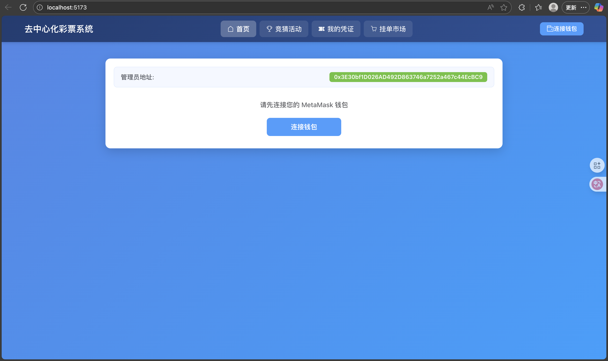

点击连接钱包按钮后会弹出MetaMask连接确认框，这里可以一次性将要用到的账户都选上

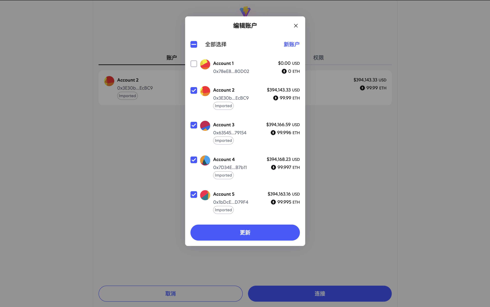

**连接钱包后**：显示管理员地址和当前用户地址，新账户代币余额为 0

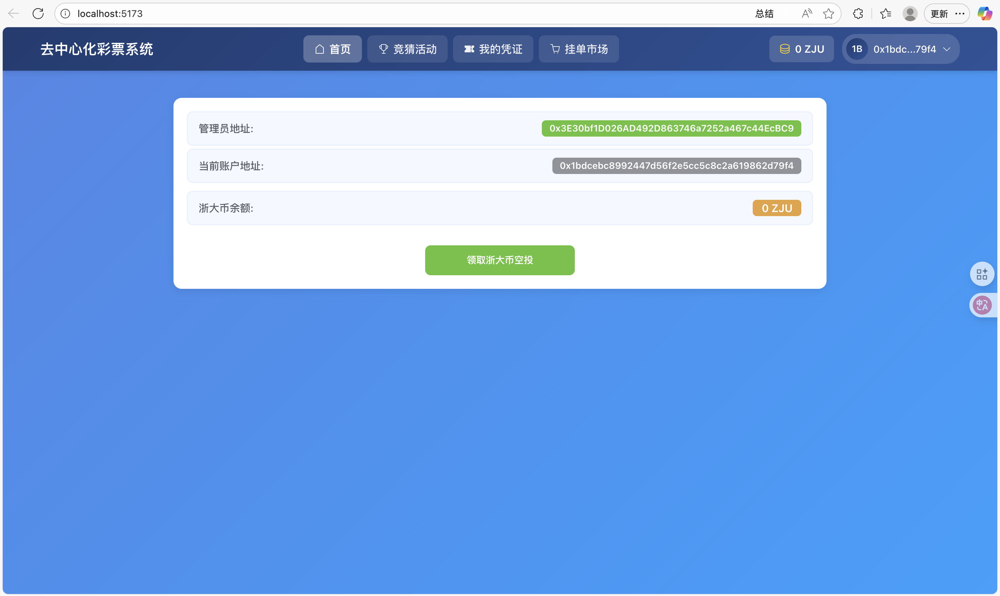

**领取空投后**：代币余额更新为 10,000，按钮变为不可用状态，防止重复领取

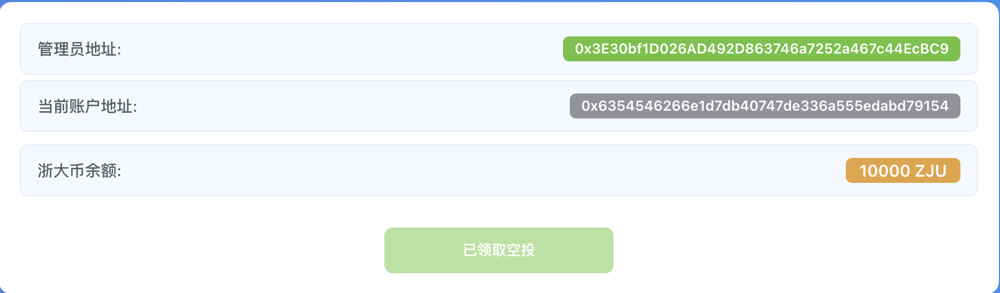

**管理员功能**：管理员用户可在首页看到创建竞猜项目的输入界面

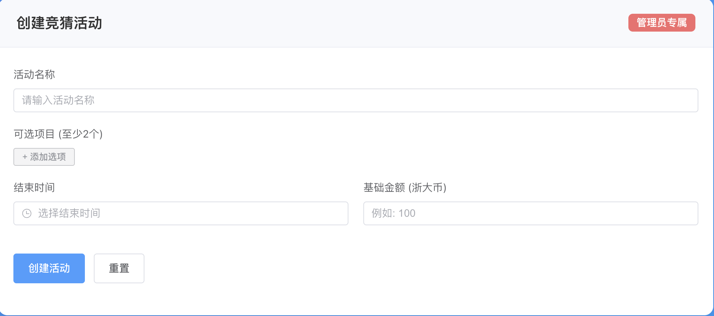

**创建活动示例**：填写完整的活动信息，系统会验证信息完整性

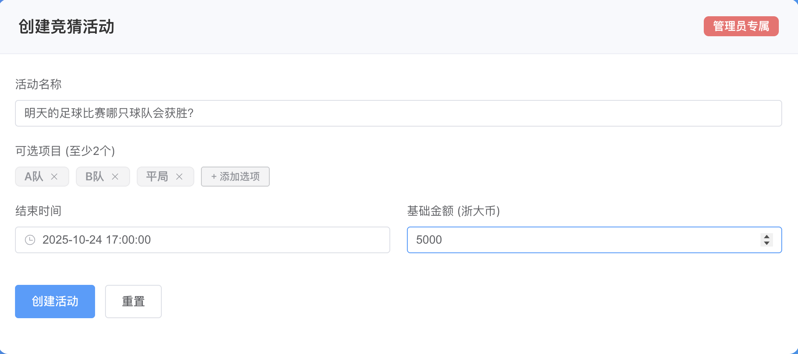

### 竞猜活动页面

**管理员视图**：管理员可查看所有活动信息，具备参与活动、开奖和退款权限

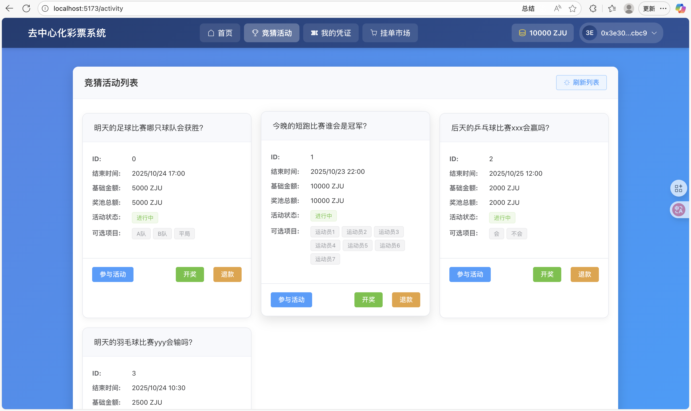

**普通用户视图**：普通用户只能查看活动信息和参与竞猜


**参与活动**：点击参与按钮弹出对话框，用户可选择投注选项和输入投注金额


购买之后也可以通过MetaMask看到彩票NFT凭证

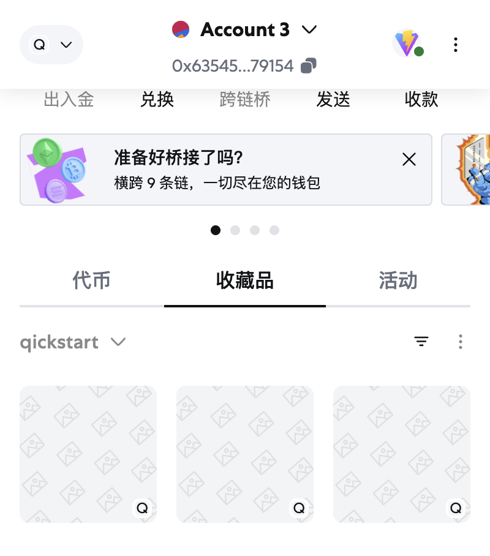

**管理员退款**：管理员可主动发起退款，系统会弹出确认对话框

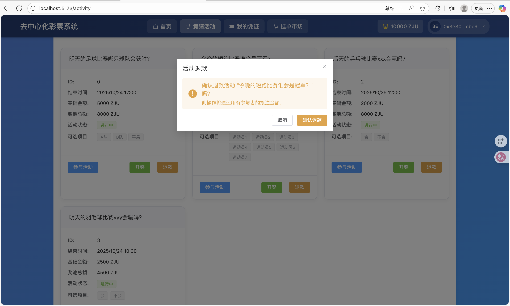

**管理员开奖**：管理员可输入竞猜结果并执行开奖，系统会弹出确认对话框

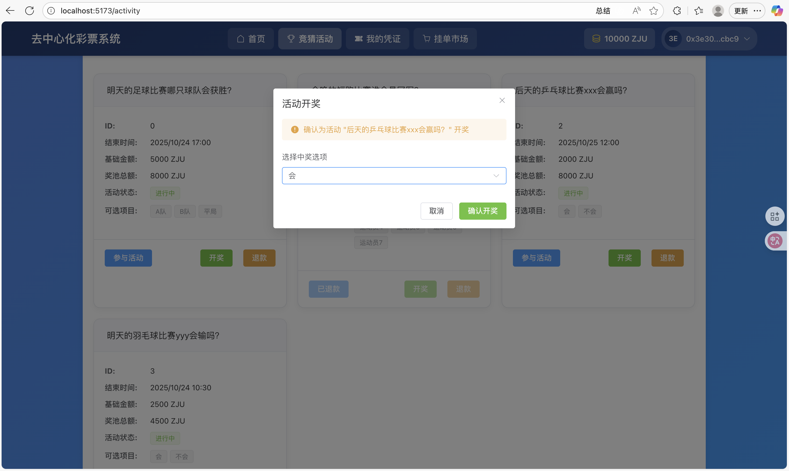

### 我的凭证界面

**凭证列表**：用户可查看自己拥有的所有彩票凭证

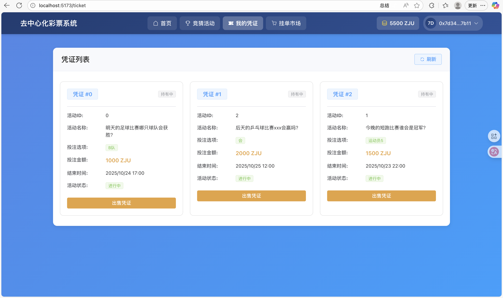

**出售凭证**：点击出售凭证按钮会弹出对话框，用户可设置出售价格

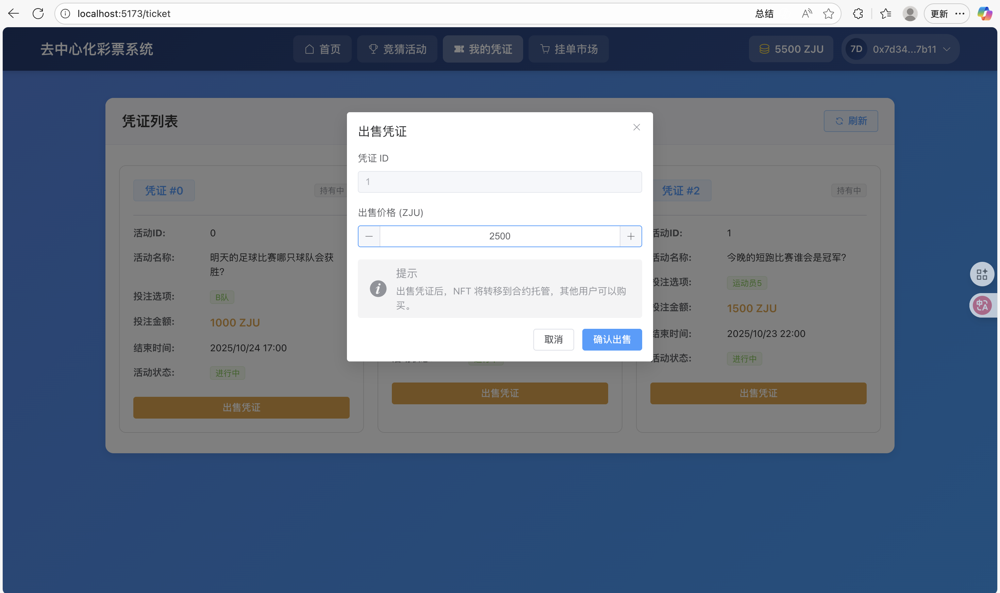

### 挂单市场界面

**市场浏览**：用户可输入活动 ID 查询该活动的所有在售彩票

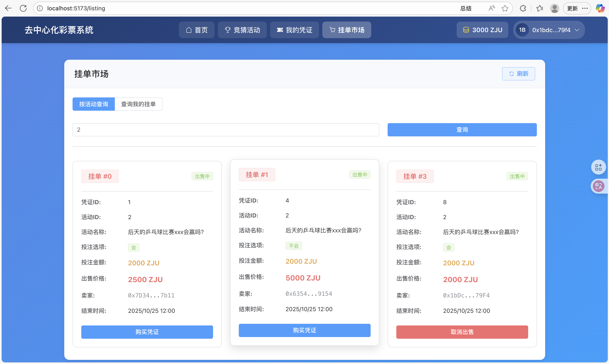

**购买凭证**：点击购买按钮弹出确认购买对话框

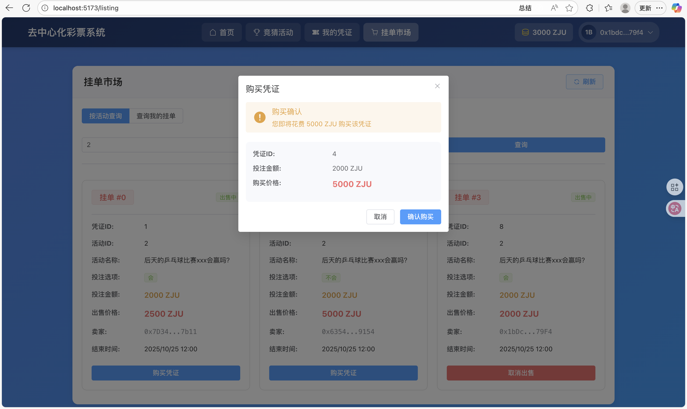

**取消挂单**：点击取消出售按钮会弹出确认取消对话框

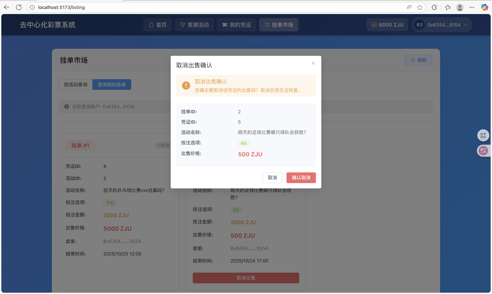

**状态更新**：操作完成后挂单状态实时更新，显示已售出或已取消状态

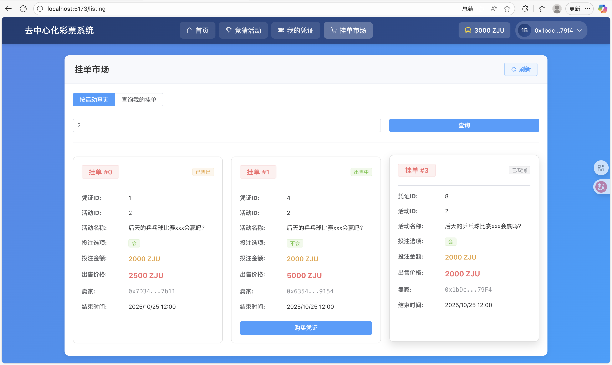

**我的挂单**：用户可查询自己的所有挂单，确认出售状态或取消不需要的挂单

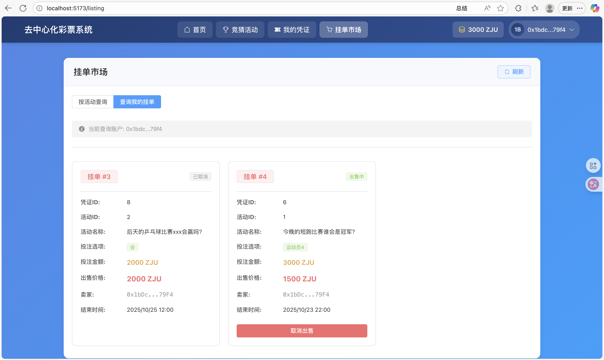

## 参考内容

- 课程的参考Demo见：[DEMOs](https://github.com/LBruyne/blockchain-course-demos)。

- 快速实现 ERC721 和 ERC20：[模版](https://wizard.openzeppelin.com/#erc20)。记得安装相关依赖 ``"@openzeppelin/contracts": "^5.0.0"``。

- 如何实现ETH和ERC20的兑换？ [参考讲解](https://www.wtf.academy/en/docs/solidity-103/DEX/)

如果有其它参考的内容，也请在这里陈列。